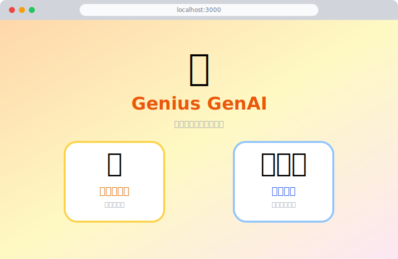
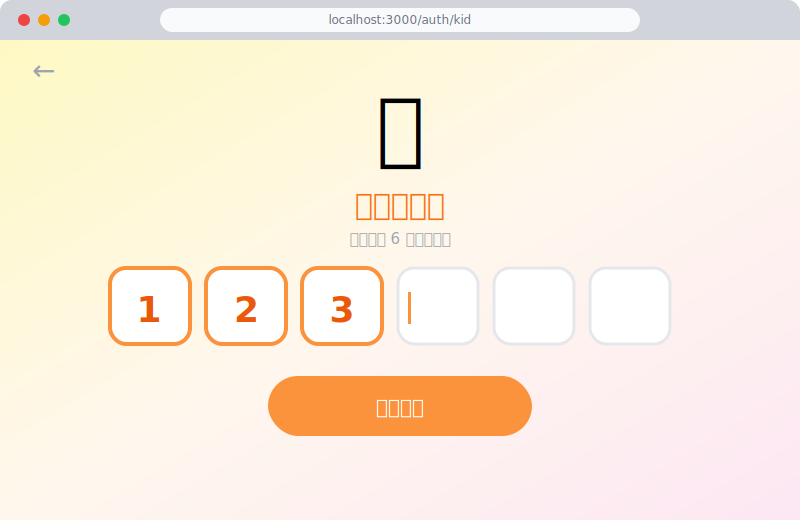
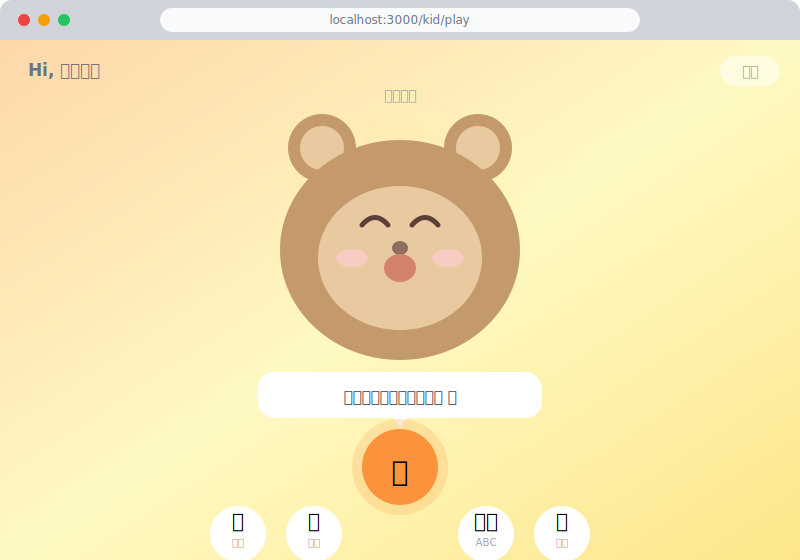
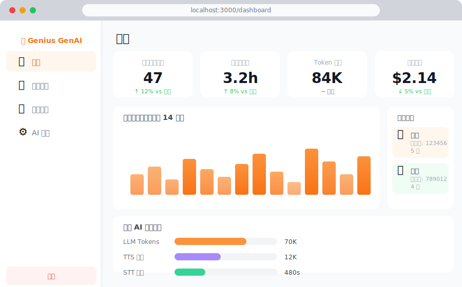
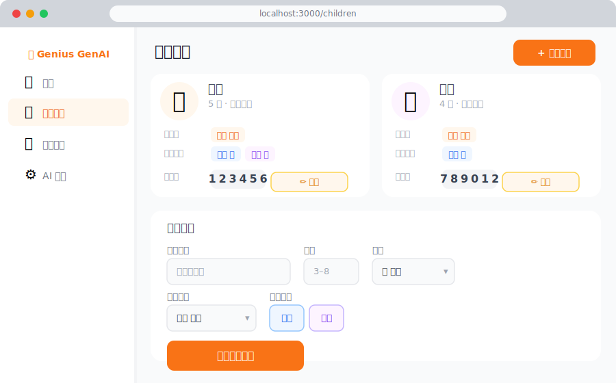

# 🌟 Genius GenAI for Kid

> 多語言 AI 語音角色陪伴平台，專為 4-6 歲兒童設計

孩子與動畫角色（小熊貝貝、小兔跳跳、小貓咪咪）用母語對話，AI 以中文、英文、西班牙語即時語音回應。父母透過網頁後台管理設定、查看對話記錄與 AI 用量。

**本版本：無需安裝 Docker，使用 SQLite 資料庫，一鍵即可啟動。**

---

## 📸 介面預覽

| 首頁角色選擇 | 小朋友登入 |
|:---:|:---:|
|  |  |

| 語音對話介面 | 家長後台總覽 |
|:---:|:---:|
|  |  |

| 孩子管理 |
|:---:|
|  |

---

## ✨ 功能特色

- 🎤 **語音對話**：按住麥克風說話，角色立即以語音回應
- 🌍 **三語支援**：中文、英文、西班牙語自由切換
- 🐻 **三種角色**：小熊貝貝、小兔跳跳、小貓咪咪，各有 SVG 動畫
- 👨‍👩‍👧 **家長後台**：用量統計、對話記錄、AI 提供者設定
- 🔒 **兒童安全**：內容過濾、PII 檢測、不當話題重導向
- 💾 **SQLite 資料庫**：無需 Docker，開箱即用

---

## 🚀 快速啟動

### 前置需求

| 工具 | 版本 |
|------|------|
| Python | 3.11+ |
| Node.js | 20+ |
| OpenAI API Key | 必要 |

### 方式一：一鍵啟動腳本

**Linux / macOS：**
```bash
git clone https://github.com/duncan19760605/GenAI-Kid.git
cd GenAI-Kid
cp .env.example apps/backend/.env
nano apps/backend/.env   # 填入 OPENAI_API_KEY 等
chmod +x start.sh && ./start.sh
```

**Windows：**
```bat
git clone https://github.com/duncan19760605/GenAI-Kid.git
cd GenAI-Kid
copy .env.example apps\backend\.env
notepad apps\backend\.env
start.bat
```

### 方式二：手動步驟

```bash
# 1. 複製並編輯設定檔
cp .env.example apps/backend/.env
# 填入：OPENAI_API_KEY, JWT_SECRET, ENCRYPTION_KEY

# 2. 啟動後端
cd apps/backend
python -m venv .venv
source .venv/bin/activate       # Windows: .venv\Scripts\activate.bat
pip install -r requirements.txt
alembic upgrade head
uvicorn app.main:app --reload --port 8000

# 3. 啟動前端（另開終端機）
cd apps/parent-ui
npm install
echo "NEXT_PUBLIC_API_URL=http://localhost:8000" > .env.local
echo "NEXT_PUBLIC_WS_URL=ws://localhost:8000" >> .env.local
npm run dev
```

開啟瀏覽器：`http://localhost:3000`

---

## ⚙️ 環境變數說明

編輯 `apps/backend/.env`：

```env
DATABASE_URL=sqlite+aiosqlite:///./genius_kid.db
JWT_SECRET=your-random-64-char-secret

# 生成 Fernet key：
# python -c "from cryptography.fernet import Fernet; print(Fernet.generate_key().decode())"
ENCRYPTION_KEY=your-fernet-key

OPENAI_API_KEY=sk-...
```

---

## 📱 使用流程

### 家長
1. `http://localhost:3000` → **我是大人** → 註冊帳號
2. **孩子管理** → 新增孩子（選角色/語言）
3. 取得孩子的 6 位數登入碼

### 小朋友
1. `http://localhost:3000` → **我是小朋友** → 輸入 6 位碼
2. 按住麥克風說話，放開後等角色回應
3. 底部按鈕：🔁 再說 / 🐢 慢點 / 🌐 換語言 / ❓ 不懂

---

## 🏗️ 專案架構

```
GenAI-Kid/
├── apps/
│   ├── backend/          # FastAPI + SQLite (aiosqlite)
│   │   ├── app/api/      # REST + WebSocket 路由
│   │   ├── app/models/   # SQLAlchemy 模型（Uuid/JSON 跨 DB 型別）
│   │   ├── app/services/ # 語音管線、安全、情緒
│   │   └── app/providers/# AI 提供者（OpenAI/Anthropic）
│   │
│   ├── parent-ui/        # Next.js 16 — 統一網頁（家長+小朋友）
│   │   └── src/
│   │       ├── app/(auth)/      # 登入頁
│   │       ├── app/(dashboard)/ # 家長後台
│   │       └── app/(kid)/       # 小朋友對話介面
│   │
│   └── kid-ui/           # Expo React Native（原生 App，選用）
│
├── start.sh / start.bat  # 一鍵啟動
└── .env.example
```

---

## 🔌 API 文件

啟動後前往：`http://localhost:8000/docs`

---

## 🆚 版本比較

| | 本版 (GenAI-Kid) | Docker 版 (GenAI-Kid-docker) |
|---|---|---|
| 資料庫 | SQLite（自動建立） | PostgreSQL 16 |
| 啟動 | `./start.sh` | `docker compose up` |
| 場景 | 個人開發 / 快速試用 | 正式部署 |

➡️ Docker 版本：[GenAI-Kid-docker](https://github.com/duncan19760605/GenAI-Kid-docker)

---

## 📄 License

MIT
